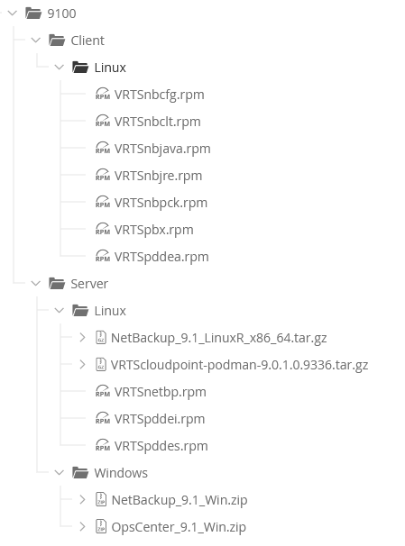
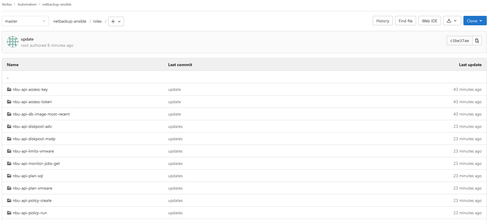

# netbackup-ansible

## Description

Veritas NetBackup is the most powerful and widely adopted data protection solution in the world. NetBackup streamlines data protection management, protects your enterprise from the unforeseen, ensures business-critical resilience and delivers customer choice with a single platform supporting any workload, cloud and architecture at any scale. For more information, visit: https://www.veritas.com/en/uk/protection/netbackup

This project contains sample Ansible roles/playbooks for automating the deployment and configuration of NetBackup. These roles/playbooks are provided as samples in order demostrate how to automate various NetBackup tasks and on how to leverage NetBackup APIs in an automation workflow. 

## Project Contents

This project contains sample Ansible playbooks/roles for automating the following tasks:

| # | Role Name | Role Description | Options / Additonal Information |
| --- | --- |--- |--- |
| 01 | `nbu-install-linux` | This role installs the NetBackup software on a RHEL server and configures the NetBackup role | Master, Media, Client - Linux |
| 02 | `nbu-install-windows` | This role installs the NetBackup software on a Windows Client and configures the NetBackup role | Client - Windows |
| 03 | `nbu-install-opscenter` | This role installs the NetBackup OpsCenter software on a Windows Server | Client - Windows |
| 04 | `nbu-install-cp` | This role installs the NetBackup software on a RHEL server and configures the NetBackup role | CloudPoint|
| 05 | `nbu-tuning-linux` | This role configures NetBackup tuning parameters | Master, Media, Client - Linux |
| 06 | `nbu-mod-global-att-set` | This role configures NetBackup Master Server Global Host Properties | - |
| 07 | `nbu-cmd-opscenter-add-master` | This role integrates a NetBackup master server into OpsCenter | - |
| 07 | `nbu-cmd-security-dr-password` | This role configures the NetBackup Catalog Backup DR File Password | - |
| 08 | `nbu-cmd-ad-integration` | This role integrates NetBackup with Active Directory domain | - |
| 09 | `nbu-api-rbac-role` | This role will configure multiple new RBAC roles in NetBackup | - |
| 10 | `nbu-api-rbac-member` | This role will add an AD group into the newly created RBAC roles in NetBackup | - |
| 11 | `nbu-api-diskpool-adv` | This role configures an Disk Pool ("AdvancedDisk") on a NetBackup Server | - |
| 12 | `nbu-api-diskpool-msdp` | This role configures an Disk Pool ("MSDP") on a NetBackup Server | Local + Cloud ("AWS") |
| 13 | `nbu-api-provider-vmware` | This role configures VMware provider in NetBackup | - |
| 14 | `nbu-api-limits-vmware` | This role configures resource limits for VMware in NetBackup | - |
| 15 | `nbu-api-slp` | To configure new NetBackup storage lifecycle policy | |
| 16 | `nbu-api-provider-aws` | To configure provider for AWS in NetBackup | |
| 17 | `nbu-api-provider-vmware` | To configure provider for VMware in NetBackup | |
| 18 | `nbu-api-access-key` | This role will generate a new API key for a user | - |
| 19 | `nbu-api-access-token` | This role will generate authorisation token for the NetBackup API | - |
| 20 | `nbu-api-policy-run` | This role will execute a manual backup using NetBackup API | - |
| 21 | `nbu-api-policy-create` | This role will create multiple types of backup policies using the NetBackup API | - |
| 22 | `nbu-api-plan-vmware` | This role will create a protection plan for VMware workloads using the NetBackup API | - |
| 23 | `nbu-api-plan-sql` | This role will create a protection plan for SQL workloads using the NetBackup API | - |
| 24 | `nbu-api-recovery-vmware-full` | This role will initiate a full VMware VM recovery using the NetBackup API | - |
| 25 | `nbu-api-db-image-most-recent` | This role will get the most recent backup ID for a client using the NetBackup API| - |
| 26 | `nbu-api-monitor-jobs-get` | This role will display a list of jobs from the Activity Monitor using the NetBackup API | - |
| 27 | `nbu-api-unishare-create` | This role will creates a Universal Share and mounts the share on Linux Client | - |

## Assumptions

 - To utilize this role, in-depth knowledge of both Veritas NetBackup and Ansible is required.
 - To use these roles in your own environment, the roles/playbooks may require some small modifications.

## How to use this project

To use this project 

    1. Clone the repository from GitHub and move to your Ansible Control Host:
 
         git clone http://www.GitHub/ansible/netbackup-ansible.git

	2. Experiment with the different roles on a test environment:

		 More information on how to use each role provided in the role README.md file
		 
		 Note - Small modifications may be required to the Ansible Role to get them to run in your environment

## Development Environment

This section provides details of the development environment used to develop these sample Ansible roles/playbooks.

### Overview

These sample Ansible roles/playbooks were developed with the following test environment:

| Description | Product / Version | 
| :--- | :--- |
| Server Platform | RedHat 8.4 - Master / Media / Linux Client |
| | Windows 2019 - OpsCenter / Windows Client | 
| Configuration Management Tool | Ansible 2.9.x	|
| Configuration Management Orchrastration | Ansible Tower 17.x |
| Software Repository | Artifactory	|		
| Code Repository | GitHub |
| Development IDE | Visual Studio |																

### Software

#### Artifactory

All NetBackup software is stored in Artifactory:

#### GitHub/GitLab

All Ansible Code is stored in GitLab:

#### Ansible Tower

Ansible Tower is used to orchastrate the running of playbooks / workflows and for secrets management. Within Ansible Tower:

1. Project has been added and syncrhorised
2. Custom Credential types have been created and relevant secrets have been configured
3. Templates have been created for the individual playbooks. The relevant credentials have been attached to the templates
4. Inventory(s) have been created

### VM Configuration

#### Local Facts

All NetBackup servers and client have local Ansible facts defined about the NetBackup environment - These facts are created when the Servers/Clients are provisioned and are leveraged by the various roles to determine information about the NetBackup domain. 

**Linux Severs:**

	The following facts defined in the local fact file ("/etc/ansible/facts.d/netbackup.fact"):

		Master Server

			[domain]
			name=<master_server_hostname>
			role=master
			truster_master=<remote_master_server_hostname or none>

		Media Server

			[domain]
			name=<master_server_hostname>
			role=media

		Client - Linux

			[domain]
			name=<master_server_hostname>
			role=client_linux

		CloudPoint

			[domain]
			name=<master_server_hostname>
			role=cloudpoint

**Windows Severs:**

	The following facts defined in the local fact file ("C:\.Ansible\netbackup.ps1"):

		Client - Windows

			@{
				domain = @{
				name = '<master_server_hostname>'
				role = 'client_windows'
				}
			}

		OpsCenter

			@{
				domain = @{
				name = '<master_server_hostname>'
				role = 'opscenter'
				}
			}

Note - All "nbu-install" roles have been developed using a dynamic inventory that is built at run time. Before a role is used, the inventory is built dynamically against all the hosts and the hosts are added to one of the following groups. This approach allows for the majority of roles to be run against inventories contains multiple NetBackup domains

	Groups
	  - master
	  - media
	  - client_linux
	  - client_windows
	  - opscenter
	  - cloudpoint

#### Server Specifictions

| # | Server Role | Platform | CPU | RAM | Disk1 | Disk 2 |
| :--- | :--- |:--- |:--- |:--- |:--- |:--- |
| 1 | Master Server | RedHat 8.4 | 2 | 4GB | disk1 - '/usr/openv' - 50GB | disk2 - /usr/openv/netbackup/db - 100GB |
| 2 | Media Server | RedHat 8.4 | 2 | 16GB | disk1 - '/usr/openv' - 50GB | disk2 - /msdp - 100GB |
| 3 | Client ("Linux") | RedHat 8.4 | 1 | 1GB | disk1 - '/usr/openv' - 5GB | - |
| 4 | Client ("Windows") | Windows 2016 / 2019 | 1 | 4GB | disk1 - 'C:\' - 5GB | - |
| 5 | OpsCenter Server | Windows 2016 / 2019 | 1 |  4GB | disk1 - 'C:\' - 100GB | - |
| 6 | CloudPoint Server | Windows 2016 / 2019 | 1 | 4GB | disk1 - 'C:\' - 100GB | - |

## More Information

To find out more information about the NetBackup APIs, please refer to NetBackup API documentation which is available on every NetBackup master server:

    https://<master_server_hostname_or_ip/api-docs/index.html

# License

The following components are available under the General Public License "GPL" 2.0 and/or the General Public License "GPL 3.0" provided herein. The source code for these GPL component(s) may be obtained at: https://github.com/VeritasOS/netbackup-ansible

## Disclaimer
The information contained in this publication is subject to change without notice. Veritas Corporation makes no warranty of any kind with regard to this manual, including, but not limited to, the implied warranties of merchantability and fitness for a particular purpose. Veritas Corporation shall not be liable for errors contained herein or for incidental or consequential damages in connection with the furnishing, performance, or use of this manual.
The software described in this book is furnished under a license agreement and may be used only in accordance with the terms of the agreement.

## Legal Notice
Last updated: 2021-07-23
Legal Notice
Copyright © 2021 Veritas Technologies LLC. All rights reserved.
Veritas, the Veritas Logo, and NetBackup are trademarks or registered trademarks of Veritas Technologies LLC or its affiliates in the U.S. and other countries. Other names may be trademarks of their respective owners.
This product may contain third-party software for which Veritas is required to provide attribution to the third party ("Third-party Programs"). Some of the Third-party Programs are available under open source or free software licenses. The License Agreement accompanying the Software does not alter any rights or obligations you may have under those open source or free software licenses. Refer to the Third-party Legal Notices document accompanying this Veritas product or available at: https://www.veritas.com/about/legal/license-agreements
The product described in this document is distributed under licenses restricting its use, copying, distribution, and decompilation/reverse engineering. No part of this document may be reproduced in any form by any means without prior written authorization of Veritas Technologies LLC and its licensors, if any.
THE DOCUMENTATION IS PROVIDED "AS IS" AND ALL EXPRESS OR IMPLIED CONDITIONS, REPRESENTATIONS AND WARRANTIES, INCLUDING ANY IMPLIED WARRANTY OF MERCHANTABILITY, FITNESS FOR A PARTICULAR PURPOSE OR NON-INFRINGEMENT, ARE DISCLAIMED, EXCEPT TO THE EXTENT THAT SUCH DISCLAIMERS ARE HELD TO BE LEGALLY INVALID. VERITAS TECHNOLOGIES LLC SHALL NOT BE LIABLE FOR INCIDENTAL OR CONSEQUENTIAL DAMAGES IN
CONNECTION WITH THE FURNISHING, PERFORMANCE, OR USE OF THIS
DOCUMENTATION. THE INFORMATION CONTAINED IN THIS DOCUMENTATION IS SUBJECT TO CHANGE WITHOUT NOTICE.

The Licensed Software and Documentation are deemed to be commercial computer software as defined in FAR 12.212 and subject to restricted rights as defined in FAR Section 52.227-19 "Commercial Computer Software - Restricted Rights" and DFARS 227.7202, et seq. "Commercial Computer Software and Commercial Computer Software Documentation," as applicable, and any successor regulations, whether delivered by Veritas as on premises or hosted services. Any use, modification, reproduction release, performance, display or disclosure
of the Licensed Software and Documentation by the U.S. Government shall be solely in accordance with the terms of this Agreement.
Veritas Technologies LLC
2625 Augustine Drive
Santa Clara, CA 95054
http://www.veritas.com

## Third-Party Legal Notices
This Veritas product may contain third party software for which Veritas is required to provide attribution ("Third Party Programs"). Some of the Third Party Programs are available under open source or free software licenses. The License Agreement accompanying the Licensed Software does not alter any rights or obligations you may have under those open source or free software licenses. This document or appendix contains proprietary notices for the Third Party Programs and the licenses for the Third Party Programs, where applicable.
The following copyright statements and licenses apply to various open source software components (or portions thereof) that are distributed with the Licensed Software.
The Licensed Software that includes this file does not necessarily use all the open source software components referred to below and may also only use portions of a given component.